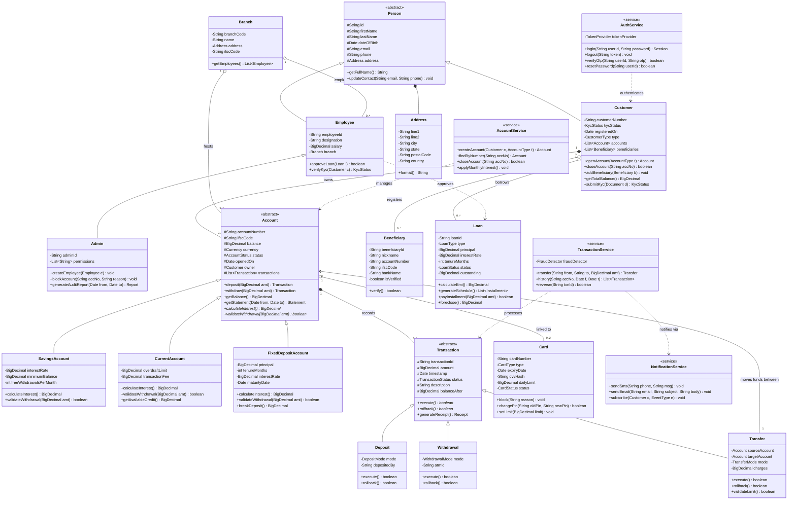

```mermaid
classDiagram
    direction TB

    %% ============ PEOPLE ============
    class Person {
        <<abstract>>
        #String id
        #String firstName
        #String lastName
        #Date dateOfBirth
        #String email
        #String phone
        #Address address
        +getFullName() String
        +updateContact(String email, String phone) void
    }

    class Customer {
        -String customerNumber
        -KycStatus kycStatus
        -Date registeredOn
        -CustomerType type
        -List~Account~ accounts
        -List~Beneficiary~ beneficiaries
        +openAccount(AccountType t) Account
        +closeAccount(String accNo) boolean
        +addBeneficiary(Beneficiary b) void
        +getTotalBalance() BigDecimal
        +submitKyc(Document d) KycStatus
    }

    class Employee {
        -String employeeId
        -String designation
        -BigDecimal salary
        -Branch branch
        +approveLoan(Loan l) boolean
        +verifyKyc(Customer c) KycStatus
    }

    class Admin {
        -String adminId
        -List~String~ permissions
        +createEmployee(Employee e) void
        +blockAccount(String accNo, String reason) void
        +generateAuditReport(Date from, Date to) Report
    }

    class Address {
        -String line1
        -String line2
        -String city
        -String state
        -String postalCode
        -String country
        +format() String
    }

    %% ============ ACCOUNTS ============
    class Account {
        <<abstract>>
        #String accountNumber
        #String ifscCode
        #BigDecimal balance
        #Currency currency
        #AccountStatus status
        #Date openedOn
        #Customer owner
        #List~Transaction~ transactions
        +deposit(BigDecimal amt) Transaction
        +withdraw(BigDecimal amt) Transaction
        +getBalance() BigDecimal
        +getStatement(Date from, Date to) Statement
        +calculateInterest()* BigDecimal
        +validateWithdrawal(BigDecimal amt)* boolean
    }

    class SavingsAccount {
        -BigDecimal interestRate
        -BigDecimal minimumBalance
        -int freeWithdrawalsPerMonth
        +calculateInterest() BigDecimal
        +validateWithdrawal(BigDecimal amt) boolean
    }

    class CurrentAccount {
        -BigDecimal overdraftLimit
        -BigDecimal transactionFee
        +calculateInterest() BigDecimal
        +validateWithdrawal(BigDecimal amt) boolean
        +getAvailableCredit() BigDecimal
    }

    class FixedDepositAccount {
        -BigDecimal principal
        -int tenureMonths
        -BigDecimal interestRate
        -Date maturityDate
        +calculateInterest() BigDecimal
        +validateWithdrawal(BigDecimal amt) boolean
        +breakDeposit() BigDecimal
    }

    class Beneficiary {
        -String beneficiaryId
        -String nickname
        -String accountNumber
        -String ifscCode
        -String bankName
        -boolean isVerified
        +verify() boolean
    }

    %% ============ TRANSACTIONS ============
    class Transaction {
        <<abstract>>
        #String transactionId
        #BigDecimal amount
        #Date timestamp
        #TransactionStatus status
        #String description
        #BigDecimal balanceAfter
        +execute()* boolean
        +rollback()* boolean
        +generateReceipt() Receipt
    }

    class Deposit {
        -DepositMode mode
        -String depositedBy
        +execute() boolean
        +rollback() boolean
    }

    class Withdrawal {
        -WithdrawalMode mode
        -String atmId
        +execute() boolean
        +rollback() boolean
    }

    class Transfer {
        -Account sourceAccount
        -Account targetAccount
        -TransferMode mode
        -BigDecimal charges
        +execute() boolean
        +rollback() boolean
        +validateLimit() boolean
    }

    %% ============ PRODUCTS ============
    class Card {
        -String cardNumber
        -CardType type
        -Date expiryDate
        -String cvvHash
        -BigDecimal dailyLimit
        -CardStatus status
        +block(String reason) void
        +changePin(String oldPin, String newPin) boolean
        +setLimit(BigDecimal limit) void
    }

    class Loan {
        -String loanId
        -LoanType type
        -BigDecimal principal
        -BigDecimal interestRate
        -int tenureMonths
        -LoanStatus status
        -BigDecimal outstanding
        +calculateEmi() BigDecimal
        +generateSchedule() List~Installment~
        +payInstallment(BigDecimal amt) boolean
        +foreclose() BigDecimal
    }

    class Branch {
        -String branchCode
        -String name
        -Address address
        -String ifscCode
        +getEmployees() List~Employee~
    }

    %% ============ SERVICES ============
    class AuthService {
        <<service>>
        -TokenProvider tokenProvider
        +login(String userId, String password) Session
        +logout(String token) void
        +verifyOtp(String userId, String otp) boolean
        +resetPassword(String userId) boolean
    }

    class AccountService {
        <<service>>
        +createAccount(Customer c, AccountType t) Account
        +findByNumber(String accNo) Account
        +closeAccount(String accNo) boolean
        +applyMonthlyInterest() void
    }

    class TransactionService {
        <<service>>
        -FraudDetector fraudDetector
        +transfer(String from, String to, BigDecimal amt) Transfer
        +history(String accNo, Date f, Date t) List~Transaction~
        +reverse(String txnId) boolean
    }

    class NotificationService {
        <<service>>
        +sendSms(String phone, String msg) void
        +sendEmail(String email, String subject, String body) void
        +subscribe(Customer c, EventType e) void
    }

    %% ============ RELATIONSHIPS ============
    Person <|-- Customer
    Person <|-- Employee
    Employee <|-- Admin
    Person *-- Address

    Account <|-- SavingsAccount
    Account <|-- CurrentAccount
    Account <|-- FixedDepositAccount

    Transaction <|-- Deposit
    Transaction <|-- Withdrawal
    Transaction <|-- Transfer

    Customer "1" *-- "0..*" Account : owns
    Customer "1" o-- "0..*" Beneficiary : registers
    Customer "1" o-- "0..*" Loan : borrows
    Account "1" *-- "0..*" Transaction : records
    Account "1" o-- "0..2" Card : linked to
    Branch "1" o-- "0..*" Employee : employs
    Branch "1" o-- "0..*" Account : hosts
    Transfer "1" --> "2" Account : moves funds between

    AccountService ..> Account : manages
    TransactionService ..> Transaction : processes
    TransactionService ..> NotificationService : notifies via
    AuthService ..> Customer : authenticates
    Employee ..> Loan : approves
```
