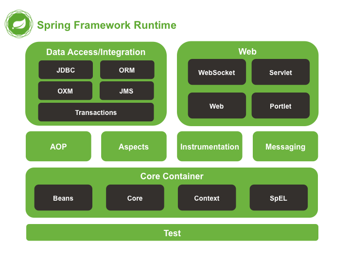
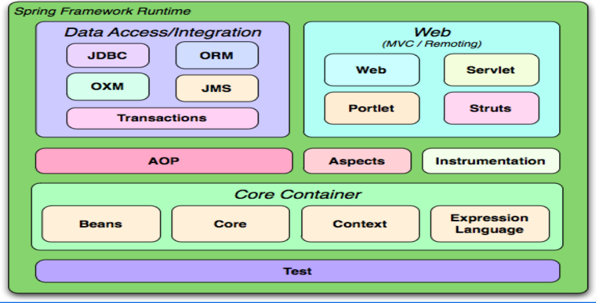

# Spring Framework
- Spring Framework is an open-source, lightweight Java framework used for developing enterprise applications. Its core features are Inversion of Control (IoC) and Dependency Injection (DI), which help create loosely coupled, maintainable, and testable applications.

## IoC (Inversion of Control)
- Spring creates and manages objects instead of the developer creating them manually.


## DI (Dependency Injection)
- Spring injects required dependencies into a class.
- Classes depend on interfaces rather than concrete implementations.

#### Without Spring:
```java
AccountService service = new AccountService();
AccountController controller =
    new AccountController(service);
```
> You are doing all the work.

#### With Spring:
```java
@Autowired
AccountService service;
```
> Spring automatically provides the object.


> @Autowired primarily injects dependencies by type. If multiple beans of the same type are available, @Qualifier or @Primary must be used to resolve the ambiguity.


## Components 
- Core Container: Manages objects (Beans).
- Dependency Injection: Connects objects automatically.
- AOP: Handles logging, security, transactions.
- Spring JDBC: Works with databases.
- Spring ORM: Works with Hibernate and JPA.
- Spring MVC: Builds web applications.
- Spring Security: Handles login and authorization.
- Spring Boot: Creates applications quickly.


# Spring Boot
- Spring Boot is a framework built on top of Spring Framework that reduces configuration and setup effort by providing auto-configuration, starter dependencies, and embedded servers.

## Why Was Spring Boot Introduced?
- Before Spring Boot, creating a Spring application required a lot of configuration.
    - Configure beans
    - Configure web.xml
    - Configure DispatcherServlet
    - Configure Tomcat server
    - Add many dependencies manually
- Developers spent a lot of time setting up the project instead of building business features. hence Spring Boot was introduced to solve this problem.

| Spring Framework             | Spring Boot                |
| ---------------------------- | -------------------------- |
| More configuration           | Less configuration         |
| Requires server setup        | Embedded server            |
| Manual dependency management | Starter dependencies       |
| Slower setup                 | Faster development         |
| Flexible but verbose         | Opinionated and simplified |


# Dependency Injection
- Dependency Injection (DI) is a design pattern in which the dependencies required by a class are provided by an external entity (Spring Container) instead of the class creating them itself.
- In Spring, the IoC Container creates the objects and injects their dependencies automatically.

## Types of Dependency Injection

### 1. Constructor Injection
```java
@Service
public class LoanService {

    private final InterestCalculator calculator;

    public LoanService(InterestCalculator calculator) {
        this.calculator = calculator;
    }
}
```
- Dependency is provided through a constructor method.

### 2. Setter Injection
```java
public class LoanService {

    private InterestCalculator calculator;

    public void setCalculator(
            InterestCalculator calculator) {
        this.calculator = calculator;
    }
}
```
- Dependency is provided through a setter method.

### 3. Field Injection
```java
@Autowired
private InterestCalculator calculator;
```

# Bean
- A Bean is an object that is created, configured, initialized, and managed by the Spring IoC Container.
- Every Bean is an Object

- Without Beans:
```java
PaymentService paymentService =
        new CreditCardPayment();

OrderService orderService =
        new OrderService(paymentService);
```

- With Beans:
```java
@Service
public class CreditCardPayment {}

@Service
public class OrderService {}
```


## Inner Bean

## Bean Scope
- Singleton
- Prototype

## Bean Lifecycle


Spring manages:

Object creation
Dependency injection
Lifecycle
Scope

## XML Configuration

```xml

<bean id="orderService"
      class="com.order.OrderService"/>
```

## Annotation Configuration
```java
@Service
public class OrderService {
}
```

```xml
<context:component-scan base-package="com.bank"/>
```


## Java Configuration
```java
@Configuration
public class AppConfig {

    @Bean
    public OrderService orderService() {
        return new OrderService();
    }
}
```

- Spring only manages classes marked with:
    - @Component
    - @Service
    - @Repository
    - @Controller


# ApplicationContext
```java
import org.springframework.context.ApplicationContext;
import org.springframework.context.support.ClassPathXmlApplicationContext;

ApplicationContext context =
        new ClassPathXmlApplicationContext("applicationContext.xml");
```

- ApplicationContext is a Spring IoC Container interface that is responsible for creating, configuring, managing, and providing access to Spring Beans.

```
ApplicationContext
--------------------------------
orderService
creditCardPayment
customerService
loanService
--------------------------------
```

- ClassPathXmlApplicationContext is an implementation of the ApplicationContext interface that loads Spring configuration from an XML file located in the application's classpath.


---

# Spring Framework



# AOP (Aspect-Oriented Programming)
- AOP (Aspect-Oriented Programming) is a programming paradigm that helps separate cross-cutting concerns such as logging, security, transaction management, auditing, and exception handling from the core business logic.


# Auto Wiring

# Stereotype Annotations
- Mark classes as Spring-managed beans.

@Component → Generic bean
@Service → Business logic layer
@Repository → Data access layer (adds exception translation)
@Controller → Web controller in MVC


# IoC (Inversion of Control)


# ORM 
# DAO
# J2EE : Jakarta to Enterprise Edition


# AppConfig.class & xml configuration

| Feature              | Java Config (`AppConfig.class`) | XML                   |
| -------------------- | ------------------------------- | --------------------- |
| Type Safety          | ✅ Yes                           | ❌ No                  |
| IDE Support          | ✅ Excellent                     | ⚠️ Limited            |
| Refactoring          | ✅ Easy                          | ❌ Manual              |
| Spring Boot Friendly | ✅ Yes                           | ❌ Rarely used         |
| Legacy Support       | ⚠️ Good                         | ✅ Excellent           |
| Readability          | ✅ Better                        | ⚠️ Can become verbose |


```java
@Configuration
public class AppConfig {

    @Bean
    public WelcomeBean welcomeBean() {
        return new WelcomeBean();
    }
}
```
Spring decides:

When to invoke welcomeBean()
How many instances to create (singleton, prototype, etc.)
When to destroy it
Who receives it through dependency injection


```java
@Service
public class UserService {

    @Autowired
    private WelcomeBean welcomeBean;
}
```

# Application Context & Why its preferred over bean factory

# What is Rest APIs

# Serverlets & Applets - just intro

# Jenkins


# POJO -> Plain Old Java Objects


# Profiles

